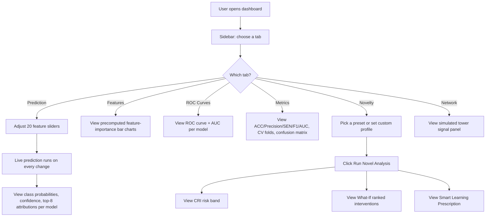
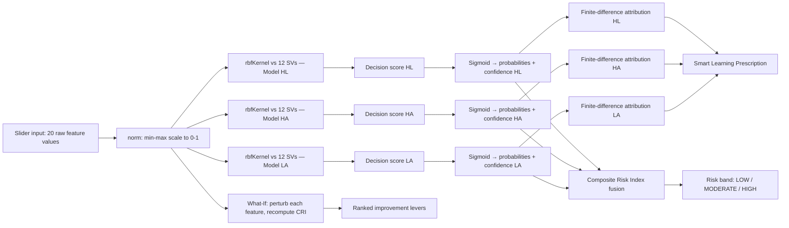

# Workflow

## 1. End-User Workflow

## 2. Data / Computation Workflow

## 3. Step-by-Step Narrative

1. **Input** — The user sets 20 feature sliders (or picks a preset student profile such as
   "High Achiever") in the Prediction or Novelty tab.
2. **Normalize** — Each raw value is rescaled to [0,1] using its declared min/max range.
3. **Kernel similarity** — The normalized vector is compared against the 12 stored support vectors
   of each of the 3 models using the RBF kernel.
4. **Decision scoring** — Kernel similarities are combined with each support vector's alpha and
   class label, plus the model's bias, into one raw decision score per model.
5. **Probability conversion** — A scaled sigmoid turns each score into two complementary class
   probabilities; the higher one is the prediction, its value is the confidence.
6. **Attribution** — Each feature is nudged slightly and the resulting score shift is measured,
   ranking the top 8 contributing features per model (shown in the Prediction and Features tabs).
7. **Risk fusion (Novelty tab)** — The three models' relevant class probabilities are combined into
   a single 0–100 Composite Risk Index and risk band.
8. **Counterfactual sweep (Novelty tab)** — Each feature is hypothetically improved by a fixed step
   and the resulting CRI drop is measured and ranked, producing the What-If recommendations.
9. **Prescription (Novelty tab)** — The top attributed features for the predicted class are mapped
   to a pre-written, prioritized list of pedagogical interventions.
10. **Display** — Results re-render immediately in the relevant panel; nothing is persisted, so
    refreshing the page resets to `DEFAULTS`.

## 4. When Recomputation Happens

| Trigger | What recomputes |
|---|---|
| Slider change in Prediction tab | All 3 `predictModel` calls (score + probability + attribution) |
| Slider change in Novelty tab | Nothing automatically — user must click **Run Novel Analysis** |
| "Run Novel Analysis" click | `computeCRI` (3× `predictModel`) + `whatIfAnalysis` (20× `computeCRI`, i.e. 60× `predictModel`) |
| Preset profile button click | Slider values are replaced; recompute follows the same rule as above per tab |
| Tab switch | No recomputation — each panel keeps/derives its own state independently |
